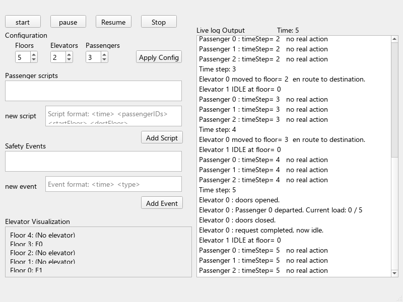

# Elevator dispatch simulator

A Qt desktop simulation of elevators, passenger requests and safety-state transitions.

## Features

- Configure floors, elevators and passengers.
- Dispatch cars using distance and an active-request penalty.
- Queue passenger journeys and advance the simulation in timed steps.
- Start, pause, resume and stop the simulation.
- Explore fire, help and overload scenarios through the interface.

## Build and run

Requires Qt 5 Widgets, qmake and a compatible C++11 compiler. Build outside the source folder:

```sh
mkdir build
cd build
qmake ../ElevatorSimulator.pro
make
./ElevatorSimulator
```

On Windows use Qt's matching MinGW toolchain and `mingw32-make`; run `release/ElevatorSimulator.exe` with Qt's `bin` directory on PATH. Qt Creator can open `ElevatorSimulator.pro` directly.

Configure the building, start the clock, add passenger requests, then use pause/resume and safety controls to observe transitions. The model is a simplified simulation, not elevator control software.

## Repository contents

| Component | Responsibility |
| --- | --- |
| MainWindow / mainwindow.ui | Controls and visual state |
| SimulationController | Configuration, dispatch and timer orchestration |
| Elevator and state classes | Requests, movement, idle/fire/overload/stop behavior |
| Floor, Passenger | Building and passenger entities |
| Dispatch strategy classes | Supporting dispatch abstraction |

Simulation data is generated locally; the app does not connect to a backend. See [provenance](PROVENANCE.md) for retrospective import context.

## Validation and example

Built with Qt 5.15.2 and MinGW 8.1. The smoke check exercises configuration, pause, a passenger journey, fire recall, resume and stop. Build `tests/smoke.pro` with qmake in a separate directory and run `elevator-smoke`; an optional image filename saves the application view.



The simulation intentionally simplifies shared rides: passengers collected together follow the active request destination. Reconfigure the simulation to reset a completed safety scenario. It has not been validated as a real building-control system.

## Historical snapshots

Related files and saved edits from the same day are grouped into a single repository snapshot. Repeated editor saves within a day are consolidated; the latest preserved file state for that day is retained. Dates follow surviving file or editor records. These are retrospective imports, not claims that the original work was pushed to GitHub on those dates. Existing contributor Git histories remain intact. See [HISTORY.md](HISTORY.md) for the grouping policy.
