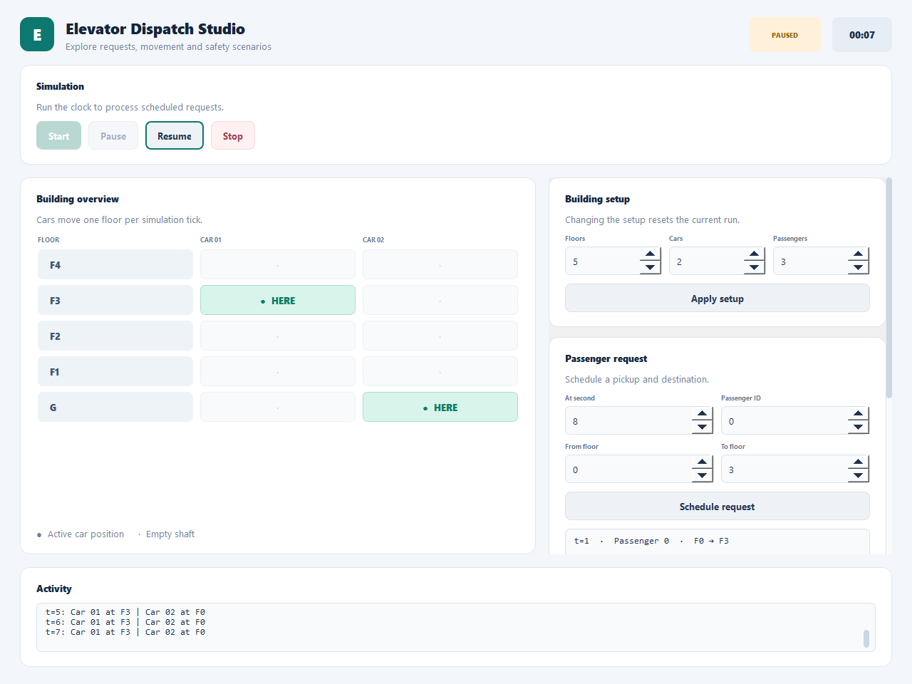

# Elevator Dispatch Studio

A Qt Widgets desktop simulator for exploring elevator dispatch, passenger journeys, and safety scenarios. Configure a building, schedule events on the simulation clock, and watch each car move through the floors.



## What you can do

- Configure 2–20 floors, up to 6 cars, and up to 50 passengers.
- Schedule a passenger pickup with a time, passenger ID, origin, and destination.
- Schedule fire recall, help, overload, or emergency stop events.
- Start, pause, resume, and stop the one-second simulation clock.
- See live car positions, run status, scheduled scenarios, and a concise activity log.

Floors and passenger IDs are zero-based: ground is floor 0, shown as **G**. A stopped run is reset with **Apply setup**. The model is intentionally simplified: passengers boarding together follow the active request destination. This is a teaching/demo simulator, not building-control software.

## Build and run

Requires Qt 5 Widgets, qmake, and a C++11 compiler supported by your Qt installation. Open `ElevatorSimulator.pro` in Qt Creator, or build outside the source tree:

```sh
mkdir build
cd build
qmake ../ElevatorSimulator.pro
make
./ElevatorSimulator
```

On Windows with Qt's MinGW kit, use `mingw32-make release` and run `release/ElevatorSimulator.exe` with the matching Qt `bin` directory on `PATH`.

## Project layout

| Path | Purpose |
| --- | --- |
| `src/model/` | Elevator, floor, passenger, and safety-state behavior |
| `src/simulation/` | Configuration, dispatch selection, clock, and events |
| `src/ui/` | Dashboard, stylesheet, and Qt resources |
| `tests/smoke.cpp` | End-to-end UI and simulation smoke check |
| `docs/simulation.png` | Current application screenshot |

The UI uses Qt layouts, so the building view and scenario forms resize with the window. Scenario inputs are bounded to the current setup; applying a new setup clears the previous schedule and returns the clock to zero.

## Validation

Build `tests/smoke.pro` in a separate directory and run `elevator-smoke`. The check exercises setup, UI scheduling, a passenger journey, fire recall, pause/resume, reset, and stopping while paused. Pass an optional PNG filename to save the window during the journey.

The project was built and smoke-tested with Qt 5.15.2 and MinGW 8.1 on Windows.

## Provenance

This repository includes retrospectively imported historical snapshots. See [PROVENANCE.md](PROVENANCE.md) and [HISTORY.md](HISTORY.md) for context.